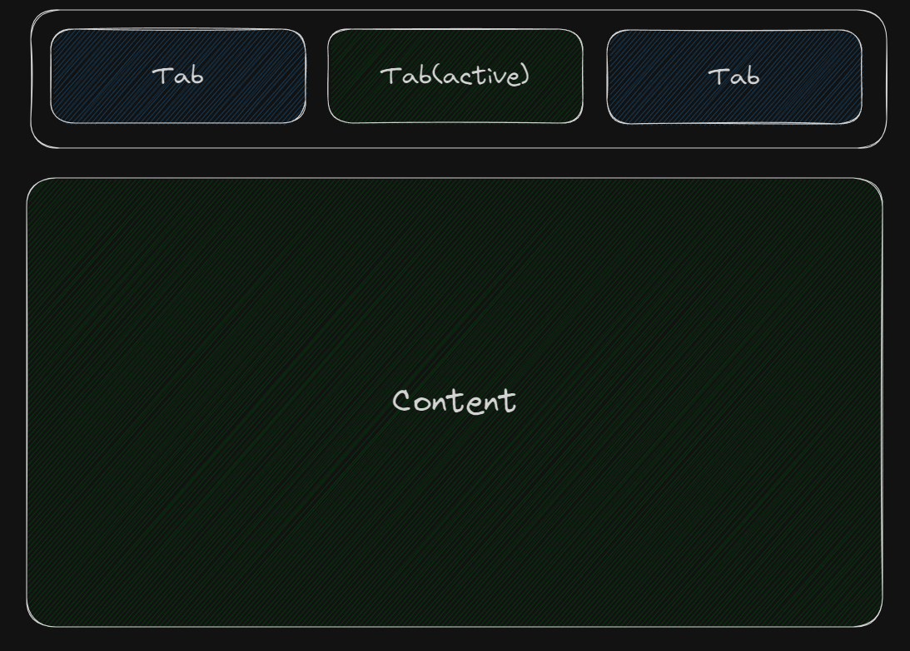

Составные компоненты – это такие компоненты, которые состоят из нескольких частей. Вместо того, чтобы делать непонятные столы, напичкать компонент шаблона логикой с кучей пропсов - подумайте много-много раз, возможно здесь подойдет как раз compound подход.

Рассмотрим вариант такого компонента – табы ([первоисточник](https://blog.logrocket.com/understanding-react-compound-components/)).

Давайте визуализируем:


Как можно заметить, компонент состоит из нескольких частей.

Выделяем главный уровень: переключатель(управление) и отображение контента. Уже 2 компонета.

Давайте представим, что кто то захочет изменить визуализацию самих табов, внутрь самого таба положить иконочку, стикер или еще чего. Мы как разработчики компонента, не знаем, чего захочет пользователь, но мы хотим ему предоставить гибкость, которая позволит сделать максимально, что возможно. Представьте, что вы продаете этот компонент в подписку, и чем дольше пользуется человек вашим компонентом – тем вы больше богатеете, но если он сделает копипасту и переделает ваш компонент, вы теряете его оплату, потому что он ушел от вашего компонента в свою реализацию. Вы должны быть заинтересованы в максимально длительном использовании вашего компонента.

Так же, хотелось бы избежать рендера ненужного JSX. Да, реального рендера не будет, но в виртуальный дом оно попадает, создает лишние объекты, нагружает GC и тратит лишнюю память.

Тогда можно накидать примерное API, то, как пользователь нашего компонента будет его использовать. Мне бы хотелось, чтобы пользователь не мучался с тем, какие есть компоненты, потому это будет использоваться так: `Tabs.Switcher`, `Tabs.Switch`, `Tabs.Content`:

```tsx
<Tabs.Switcher>
  <Tabs.Switch tabId="1" tabSize="medium">
    Tab 1
  </Tabs.Switch>
  <Tabs.Switch tabId="2" tabSize="medium">
    Tab 2
  </Tabs.Switch>
</Tabs.Switcher>
<Tabs.Content>
  {(currentTabId) => {
    switch (currentTabId) {
      case '1':
        return <div className={cx(styles.body, styles[`body_first`])} />
      case '2':
        return (
          <div className={cx(styles.body, styles[`body_second`])} />
        )
      default:
        console.error('Unreachable branch in tabs')
        return null
    }
  }}
</Tabs.Content>
```

Но при таком использовании нет связи между переключателем и контентом, сделаем `Tabs` как компонент и добавим контекст.

Итог будет такой:

```tsx
<Tabs active={currentTabId} onActiveChange={handleChangeId}>
  <Tabs.Switcher>
    <Tabs.Switch tabId="1" tabSize="medium">
      Tab 1
    </Tabs.Switch>
    <Tabs.Switch tabId="2" tabSize="medium">
      Tab 2
    </Tabs.Switch>
    <Tabs.Switch tabId="3" tabSize="medium">
      Tab 3
    </Tabs.Switch>
    <Tabs.Switch tabId="4" tabSize="medium">
      Tab 4
    </Tabs.Switch>
    <Tabs.Switch tabId="5" tabSize="medium">
      Tab 5
    </Tabs.Switch>
  </Tabs.Switcher>
  <Tabs.Content>
    {(currentTabId) => {
      switch (currentTabId) {
        case '1':
          return <div className={cx(styles.body, styles[`body_first`])} />
        case '2':
          return <div className={cx(styles.body, styles[`body_second`])} />
        case '3':
          return <div className={cx(styles.body, styles[`body_third`])} />
        case '4':
          return <div className={cx(styles.body, styles[`body_fourth`])} />
        case '5':
          return <div className={cx(styles.body, styles[`body_fifth`])} />
        default:
          console.error('Unreachable branch in tabs')
          return null
      }
    }}
  </Tabs.Content>
</Tabs>
```

Опишем главную входную точку:

```tsx
import React, { useEffect, useMemo, useState } from 'react'

import { useEvent } from '../../hooks'
import { Content } from './Content'
import { Switch } from './Switch'
import { Switcher } from './Switcher'
import { Context, TabsContext, themes } from './context'

export type TabsProps = React.PropsWithChildren<{
  theme?: ValueOf<typeof themes>
  active: string
  onActiveChange?: (active: string) => void
}>

function Tabs(props: TabsProps) {
  const {
    theme = 'primary',
    active: activeProps,
    children,
    onActiveChange,
  } = props

  const [active, setActiveId] = useState(activeProps)

  const handleActiveChange = useEvent((active: string) => {
    onActiveChange?.(active)
  })

  const value = useMemo(
    (): Context => ({ active, change: setActiveId, theme }),
    [active, theme],
  )

  useLayoutEffect(() => {
    // sync state active tab from outside
    setActiveId(activeProps)
  }, [activeProps])

  useEffect(() => {
    if (activeProps !== active) {
      handleActiveChange(activeProps)
    }
  }, [active, handleActiveChange])

  return <TabsContext.Provider value={value}>{children}</TabsContext.Provider>
}

Tabs.themes = themes
Tabs.Switcher = Switcher
Tabs.Switch = Switch
Tabs.Content = Content

export { Tabs }
```
